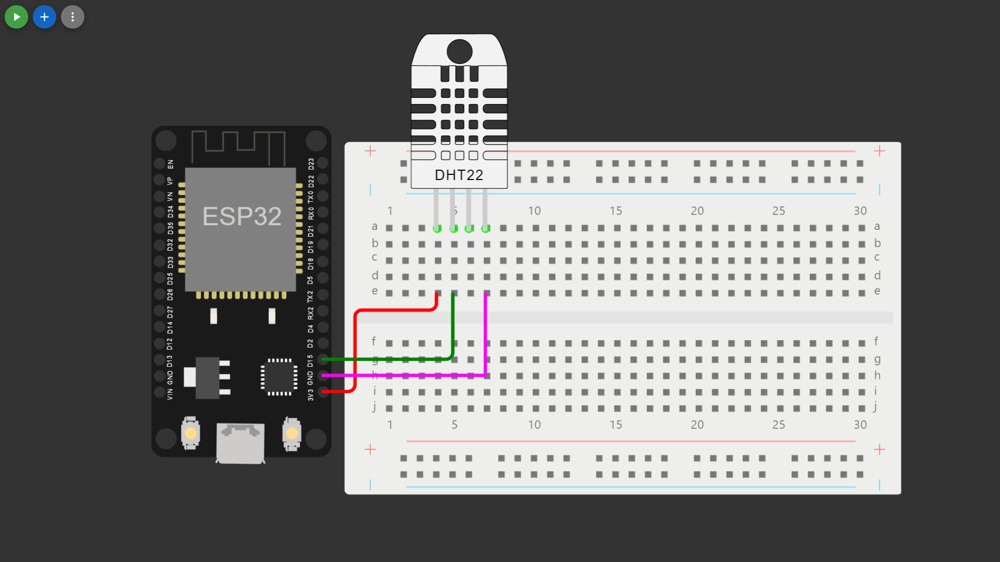

In this technology project you will begin building your project by deploying IoT devices and then developing a Python script on the IoT devices as per the project requirement. After performing the relevant activities create a document around it and share the same for assessment.

---

# Phase 3: Building and Developing with IoT Devices

In this technology project, you will embark on the journey of building an environmental monitoring system using IoT devices. Your project will involve deploying IoT devices and developing a Python script to collect and process environmental data. Here, we'll provide guidance on simulating the use of an ESP32 and a DHT22 sensor on the Wokwi platform.

To find temperature and humidity using an ESP32 on the Wokwi platform, you can simulate the DHT22 sensor along with the ESP32. Here's a detailed guide:

1. **Go to [Wokwi](https://wokwi.com/):**
   - To get started, you will need to access the Wokwi platform.
   - Start by visiting the Wokwi website.

2. **Create a New Project:**
   - Click the "New Project" button to initiate the creation of a new project. This project will be the virtual workspace for your environmental monitoring setup.

3. **Select the ESP32:**
   - In the "Select a board" section, type "ESP32" in the search bar and choose an ESP32 board model (e.g., ESP32 Dev Module). This step is akin to selecting the hardware component for your project.

4. **Add the DHT22 Sensor:**
   - In the components panel on the left, search for "DHT22" or "DHT11."
   - Drag and drop the DHT22 component onto the breadboard area. This replicates the physical act of connecting a DHT22 sensor to your ESP32 board.

5. **Connect the Components:**
   - Simulate the connections between the DHT22 sensor and the ESP32 following your wiring instructions. You can click on the components to establish the electrical connections.
   - Connect the sensor's VCC and GND pins to the ESP32's 3.3V and GND, respectively.
   - Connect the sensor's data pin to a GPIO pin on the ESP32 (e.g., GPIO 4). Ensure that these connections match how you'd wire the components in a real-world scenario.

6. **Write the Code:**
   - Click on the ESP32 component to open the code editor. This step is equivalent to writing and uploading code to your ESP32 microcontroller.
   - Write the Arduino code to read temperature and humidity from the DHT22 sensor. Here's an example code snippet:

```ino
#include "DHT.h"
#define DHTPIN 15
#define DHTTYPE DHT22

DHT dht(DHTPIN, DHTTYPE);

void setup() {
Serial.begin(9600);
Serial.println(F("DHTxx test!"));

dht.begin();
}

void loop() {

delay(2000);

float h = dht.readHumidity();
// Read temperature as Celsius
float t = dht.readTemperature();
// Read temperature as Fahrenheit
float f = dht.readTemperature(true);

// Check
if (isnan(h) || isnan(t) || isnan(f)) {
    Serial.println(F("Failed to read from DHT sensor!"));
    return;
}

// Compute heat index in Fahrenheit
float hif = dht.computeHeatIndex(f, h);
// Compute heat index in Celsius
float hic = dht.computeHeatIndex(t, h, false);

Serial.print(F("Humidity: "));
Serial.print(h);
Serial.print(F("%  Temperature: "));
Serial.print(t);
Serial.print(F("°C "));
Serial.print(f);
Serial.print(F("°F  Heat index: "));
Serial.print(hic);
Serial.print(F("°C "));
Serial.print(hif);
Serial.println(F("°F"));
}
```

7. **Run the Simulation:**
   - Click the "Run Simulation" button to start the simulation. This action simulates the execution of your code on the ESP32.
   - The ESP32 code will run, and you'll see the temperature and humidity values printed in the Wokwi Serial Monitor, just as you would on a physical ESP32 board with the sensor.

#### Simulated Images:

